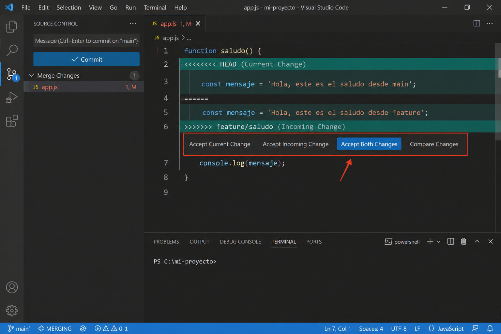

# `git pull`

Modifica la rama actual

Y puede producir:

- merges automáticos

- conflictos

- commits de merge

Por eso muchos desarrolladores prefieren:

``` bash

git fetch

```

y luego decidir qué hacer.

## Variante moderna: rebase

A veces git pull usa:

``` bash

git pull --rebase

```

que equivale a:

``` bash

git fetch
git rebase

```

Esto mantiene un historial más limpio.

## Resumen

| Comando             | Qué hace                    |
| ------------------- | --------------------------- |
| `git fetch`         | Descarga cambios del remoto |
| `git merge`         | Mezcla cambios en tu rama   |
| `git pull`          | Hace fetch + merge          |
| `git pull --rebase` | Hace fetch + rebase         |


## Diferencia entre `rebase` y `fast-forward`

### 1. Fast-forward

**Es un tipo de merge.**

Git simplemente mueve el puntero de la rama hacia adelante.

No crea commits nuevos.

### 2. Rebase

Es una operación que:

- reescribe commits

- cambia el historial

- mueve tus commits “encima” de otros

## Ejemplo Fast Forward

### Antes

```

main
A --- B

origin/main
A --- B --- C --- D

```

La rama local no tiene commits propios.

Está simplemente atrasada.

Hacemos:

``` bash

git pull

```

Git hace:

``` bash

git fetch
git merge

```

Pero como no hay divergencia…

Git puede hacer un:

**Fast-forward merge**

### Resultado

```

main
A --- B --- C --- D

```

Git solo movió el puntero de `main`.

No creó commit de merge.

Entonces Fast-forward significa:

- La rama puede avanzar linealmente sin conflictos.

### ¿Cuándo no puede hacer fast-forward?

Cuando ambas ramas avanzaron.

Ejemplo

```

main
A --- B --- X

origin/main
A --- B --- C --- D

```

Aquí ambas tienen commits distintos.

### Ahora Git necesita unir historias

Entonces hace un merge real:

```

A --- B --- X -------- M
          \          /
           C --- D

```

`M` es un merge commit.

## Ejemplo `rebase`

Tenemos esto

```

main
A --- B --- X

origin/main
A --- B --- C --- D

```

Si hacemos `merge`

``` bash

git pull

```

Obtenemos:

```

A --- B --- X -------- M
          \          /
           C --- D

```

Historial con bifurcación.

### Pero si hacemos `rebase`

``` bash

git pull --rebase

```

Git hace:

1. Quita temporalmente `X`

2. Avanza la rama a `C-D`

3. Reaplica `X`

### Resultado

```

A --- B --- C --- D --- X'

```

Miremos a:

```

X'

```

- No es el mismo commit.

- Git creó uno nuevo.

### La diferencia

### Fast-forward

- No reescribe historial.

- Solo mueve punteros.

### Rebase

- SÍ reescribe historial.

- Crea commits nuevos.

### Fast-forward es simple avance

```

ANTES:
A --- B

DESPUÉS:
A --- B --- C

```

Solo avanzó.

### Rebase reconstruye historia

```

ANTES:
A --- B --- X
         \
          C --- D

Después:

A --- B --- C --- D --- X'

```

## IMPORTANTE

### Fast-forward

- ✅ seguro

- ✅ simple

- ✅ no cambia hashes

### Rebase

- ⚠️ cambia hashes

- ⚠️ reescribe commits

- ⚠️ puede ser peligroso si ya hicimos push

**Nota:** Si ocurren conflictos durante `git pull`, Visual Studio Code puede abrir los archivos en conflicto para que decidamos cómo resolver el merge.

Opciones comunes:

- Accept Current Change
- Accept Incoming Change
- Accept Both Changes
- Compare Changes



Después de resolver los conflictos, se debe hacer:

```bash

git add .
git commit
git push

```
Y se va a crear un commit nuevo en GitHub