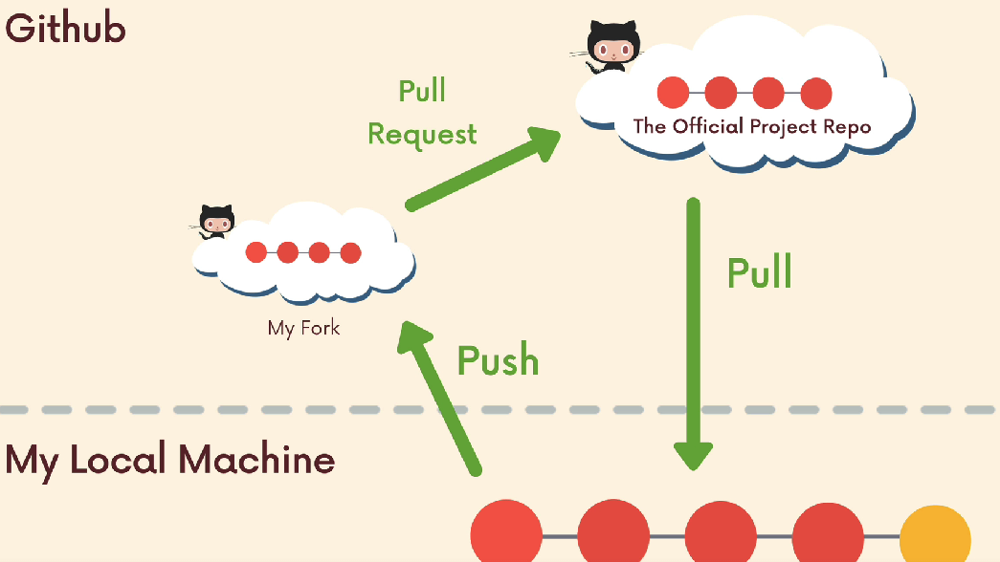

# Fork

Un **fork** es una copia de un repositorio de GitHub que pasa a estar bajo nuestra propia cuenta de GitHub.

## ¿Para qué sirve?

Principalmente para poder trabajar sobre un proyecto en el que no tenemos permisos de escritura.

## Ejemplo:

Imagina que alguien tiene un documento:

- 📄 Proyecto original

Nosostros queremos modificarlo, pero el dueño no nos deja editar su documento.

Entonces hacemos una fotocopia:

- 📄 Mi copia del proyecto

Ahora podemos escribir, borrar y modificar la copia como queramos.

Eso es conceptualmente un **fork**.

La diferencia importante es que GitHub sabe que:

```

Nuestra copia
   ↑
   │ está basada en
   │
Proyecto original

```

Por eso posteriormente podemos proponer que nuestros cambios se incorporen al proyecto original.

## Fork ≠ clone

Esta diferencia es muy importante.

Un fork ocurre en GitHub:

```

GitHub
Original ──────→ Nuestro fork

```

Un **clone** ocurre cuando llevamos un repositorio de GitHub a nuestra computadora:

```

GitHub                       Nuestra computadora

Nuestro fork  ── clone ──→   proyecto/

```

## En resumen

**Fork** es crear en GitHub nuestra propia copia de un repositorio que pertenece a otra persona/organización, para poder trabajar sobre él sin modificar directamente el original.

# Hacer Pull Request a un reposotorio que no tenemos acceso de colaboradores



La idea clave es esta:

- Si no tenemos permisos de escritura sobre el repositorio principal, no podemos simplemente hacer `push` directamente allí. Entonces hacemos un `fork`, trabajamos en nuestra copia y luego proponemos los cambios mediante un **Pull Request** (PR).


## Hay 3 lugares diferentes

                 GitHub
       ┌─────────────────────────┐
       │                         │
       │  Repositorio original   │
       │  empresa/proyecto       │
       │           ↑             │
       │           │ PR          │
       │           │             │
       │  Tu fork                │
       │  tu-usuario/proyecto    │
       │           ↑             │
       └───────────│─────────────┘
                   │ push
                   │
             Tu máquina

Y cada flecha significa algo diferente:

### 1. `push`

    Nuestra máquina → nuestro fork

Subimos nuestros **commits** a GitHub.

### 2. `pull`

    Repositorio remoto → nuestra máquina

Trae cambios a nuestro repositorio local.

### 3. Pull Request

    Nuestro fork → repositorio original

Proponemos que nuestros cambios sean incorporados al proyecto principal.

## ¿Y si SÍ somos colaboradores?

Entonces normalmente no necesitamos hacer **fork**.

Si tenemos permisos de escritura:

```

Repositorio original
github.com/empresa/proyecto
        ↑
        │ push
        │
    Nuestra máquina

```

Podemos crear una rama en el repositorio original:

    git switch -c mi-funcionalidad

hacer nuestros commits y subirla:

    git push -u origin mi-funcionalidad

Y después podemos crear un **PR** desde esa rama hacia main.

## Resumen

- **Sin permisos de escritura** → Fork → rama → cambios → push a nuestro fork → PR al repositorio original.

- **Con permisos de escritura** → rama en el repositorio original → cambios → push → PR.

## Importante

**Un Pull Request** no significa necesariamente "traer cambios".

Aunque se llame **Pull Request**, desde nuestra perspectiva estamos proponiendo que el proyecto principal **"jale"** (pull) nuestros cambios.