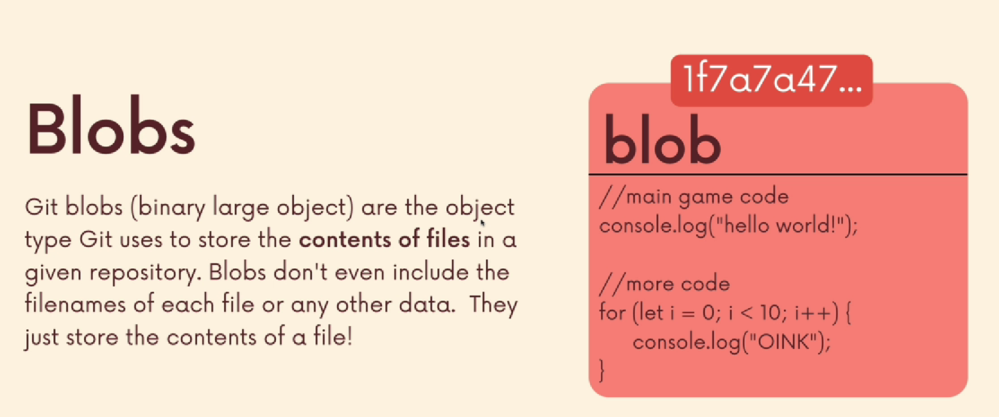
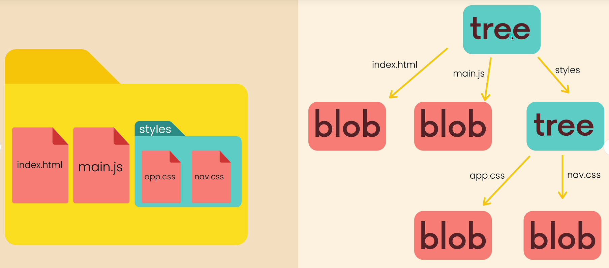
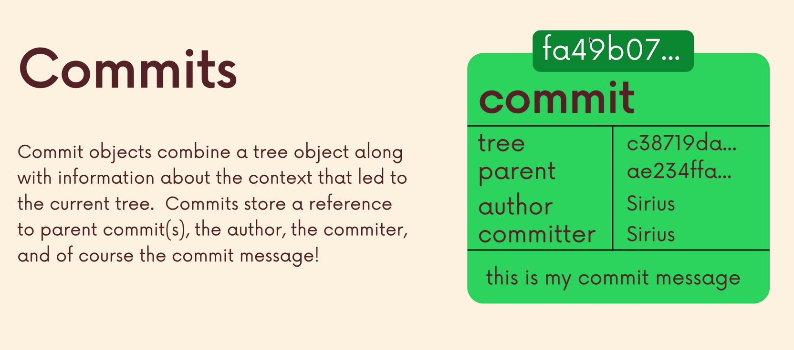
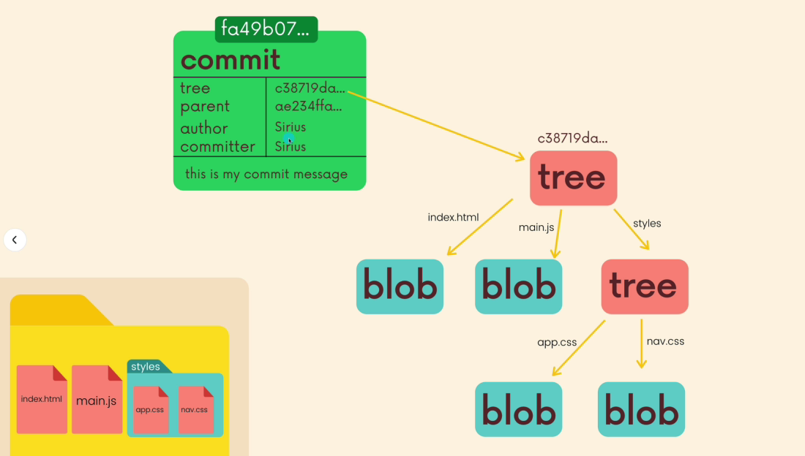

# 1. Blob



Un blob tipo de objeto que almacena los datos/contenido de un archivo.

El blob no sabe que el archivo se llama `game.js`.

    blob
    │
    └── "// main game code
        console.log("hello world!");
        ...
        "

## 1. Esto es lo que la diapositiva quiere decir con:

- "Blobs don't even include the filenames"

Es decir, el blob no contiene el nombre del archivo.

### Ejemplo:

    game.js

contiene:

``` javascript

console.log("hello");

```

Git podría tener:

    BLOB
    hash: 1f7a7a47...
    contenido:
    console.log("hello");

Pero dentro del blob no existe algo como:

    filename = game.js

El blob solo tiene:

``` javascript

console.log("hello");

```

Aquí es donde entra el -->

# 2. Tree

Un **tree** representa la estructura de directorios y archivos.




    tree
    ├── index.html → blob
    ├── main.js    → blob
    └── styles/    → tree
        ├── app.css → blob
        └── nav.css → blob

Así Git puede representar la estructura completa del proyecto.

El siguiente comando significa:

    git cat-file -p


- Muéstrame el contenido de este objeto de Git de una forma legible.

Entonces `master` es una rama que apunta al último **commit** de esa rama.

    git cat-file -p master^{tree}

### Ejempo:

    master
    │
    ▼
    [commit A]
    │
    ▼
    [tree]
    ├── index.html → blob
    ├── main.js    → blob
    └── styles     → tree

Cuando le ponemos:

    master^{tree}

Significa: "**Dame el tree al que apunta el commit al que apunta master.”**

### Salida:

    100644 blob a1b2c3...    index.html
    100644 blob d4e5f6...    main.js
    040000 tree 123abc...    styles

**Ojo:** No estamos viendo el contenido de `index.html` todavía. 

Estamos viendo el `tree`, es decir, la estructura que dice qué archivos existen y a qué objetos `blob` apuntan.

# 3. Commit



Un `commit` almacena información sobre un estado del proyecto y apunta al `tree` que representa ese estado.

## 3.1 Estructura



    commit
    │
    │ tree
    ▼
    tree
    ├── index.html → blob
    ├── main.js    → blob
    └── styles     → tree
                        ├── app.css → blob
                        └── nav.css → blob

El `commit` **no almacena directamente el contenido** de `index.html` o `main.js`.

Almacena una referencia al `tree`, y ese `tree` es el que termina llevando hacia los `blob`.

## 3.2 ¿Qué almacena un commit?

    commit
    ├── tree       c38719da...
    ├── parent     ae234ffa...
    ├── author     Sirius
    ├── committer  Sirius
    └── mensaje    this is my commit message

## Un commit contiene principalmente:

### 3.2.1 `tree`

Una referencia al objeto `tree` que representa cómo estaba el proyecto en ese momento.

Ejemplo:

    tree → c38719da...

Ese hash identifica un objeto `tree`.

### 3.2.2 `parent`

Una referencia al commit anterior.

    parent → ae234ffa...

Esto es lo que permite que Git construya la historia:

    commit C
    │
    ▼
    commit B
    │
    ▼
    commit A

Por eso Git puede decir:

- Este commit viene después de este otro.`

Un `commit` normalmente tiene un `parent`, aunque hay excepciones:

- El primer `commit` de un repositorio no tiene `parent`.

- Un `commit` de merge puede tener dos o más parents.

### 3.2.3 `author`

Quién escribió originalmente los cambios.

    author → Sirius

### 3.2.4 `committer`

Quién creó/registró ese `commit` en Git.

    committer → Sirius

Muchas veces son la misma persona, pero conceptualmente son cosas diferentes.

### 4 `git cat-file <opción> <hash>`

- `-t` Se refiere al tipo de objeto

              git cat-file -t

                    │
                    ▼
             ¿Qué tipo es?
                    │
        ┌───────────┼───────────┐
        ▼           ▼           ▼
       blob        tree       commit

- `-p` Significa **Pretty Print**

        git cat-file -p fa49b07...
                |
                ▼
        tree c38719da...
        parent ae234ffa...
        author Sirius ...
        committer Sirius ...

        this is my commit message

| Comando                | Significado      | Resultado                       |
| ---------------------- | ---------------- | ------------------------------- |
| `git cat-file -t HASH` | **type**         | Dice qué tipo de objeto es      |
| `git cat-file -p HASH` | **pretty-print** | Muestra el contenido del objeto |

# Resumen

              OBJETOS DE GIT
                    │
       ┌────────────┼────────────┐
       ▼            ▼            ▼
     blob          tree        commit
       │            │            │
    contenido    estructura    historia +
    archivo      directorios   metadatos
                                + referencia
                                    al tree

# Otro tipo de objeto en Git --> [`tags`](21.%20git%20tags.md)

Un `tag` es básicamente un nombre que le ponemos a un punto específico de la historia de Git.

Por ejemplo:

    A --- B --- C --- D --- E
                ↑
            versión 1.0

Podríamos decir:

    v1.0 → C

En lugar de tener que recordar el hash:

    c38719da82f...

podemos referirnos a ese commit como:

    v1.0

Esto es muy común para marcar versiones:

    v1.0
    v1.1
    v2.0
    v2.1

## Hay dos tipos principales de `tags`

Git tiene:

### 1. Lightweight tag

Es simplemente una referencia a otro objeto.

    v1.0
    │
    ▼
    commit

Es prácticamente como ponerle un "alias" al commit.

### 2. Annotated tag

Un **annotated tag** es un objeto de Git por sí mismo.

### Estructura

    annotated tag
        │
        │ apunta a
        ▼
        commit
        │
        ▼
        tree
        │
        ▼
        blobs

**IMPORTANTE**

Un **annotated tag** no es solo el nombre del commit. Git crea un objeto tag que **contiene información adicional**.

Almacena cosas como:

    object   <hash>
    type     commit
    tag      v1.0
    tagger   Sirius
            
    Release version 1.0

### Ejemplo

    tag
    ├── object → fa49b07...
    ├── type   → commit
    ├── tag    → v1.0
    ├── tagger → Sirius
    │
    └── mensaje
        Release version 1.0

Este objeto se parece mucho a un `commit`.

## 3. ¿Por qué se llama "annotated"?

**Annotated** significa: **anotado**

Porque no solamente tiene:

    v1.0 → este commit

sino que puedes agregar información sobre ese **tag**.

Por ejemplo:

    v1.0

    Release version 1.0
    First stable release of the application.

Además, queda registrado quién creó el tag y cuándo.

Por eso los **annotated tags** son especialmente útiles para **versiones/releases**.

## 4. ¿Cómo crear uno?

Sintaxis:

``` Bash

git tag -a v1.0 -m "Version 1.0"

```

Crea un **annotated** tag llamado `v1.0`.

### 4.1 Comando para trabajar con tags.

    git tag

### 4.2 Significa annotated.

    -a

### 4.3 Nombre del tag.

    v1.0

### 4.4. Mensaje del tag.

    -m "Version 1.0"

## 5. ¿A qué commit apunta?

Si no se especifica ningún commit:

    git tag -a v1.0 -m "Version 1.0"

Git coloca el tag sobre el commit en el que está actualmente, normalmente `HEAD`.

Si `HEAD` apunta por ejemplo al `commit C`

    HEAD
    ↓
    commit C

Después:

       v1.0
        ↓
    tag object
        ↓
    commit C

### Podemos ver el tipo de dato

    git cat-file -t v1.0

Resultado:

    tag

Ver los datos con `-p`

    git cat-file -p v1.0

Resultado:

    object fa49b07...
    type commit
    tag v1.0
    tagger Sirius <...> ...

    Version 1.0

Diagrama completo:

    v1.0
    │
    │ referencia
    ▼
    TAG OBJECT
    │
    │ object
    ▼
    COMMIT
    │
    │ tree
    ▼
    TREE
    │
    ├── BLOB
    ├── BLOB
    └── TREE
        ├── BLOB
        └── BLOB

# Resumen de todos los objetos

    blob
    ↓
    guarda contenido de archivos

    tree
    ↓
    guarda estructura y referencias

    commit
    ↓
    guarda información de un snapshot + referencia al tree

    tag
    ↓
    guarda información sobre una referencia
        a otro objeto (normalmente un commit)

## 6. 9. Diferencia entre tag y commit?

### Un commit representa:

- Este fue un estado del proyecto y esta es su historia.

### Los annotated tag representan:

- Ponerle una **etiqueta/nombre/mensaje** a este objeto y además guardar información sobre esa etiqueta.

Por ejemplo:

    commit:
    "Estos eran los archivos del proyecto en este momento."

    tag:
    "Este commit corresponde a la versión oficial v1.0."