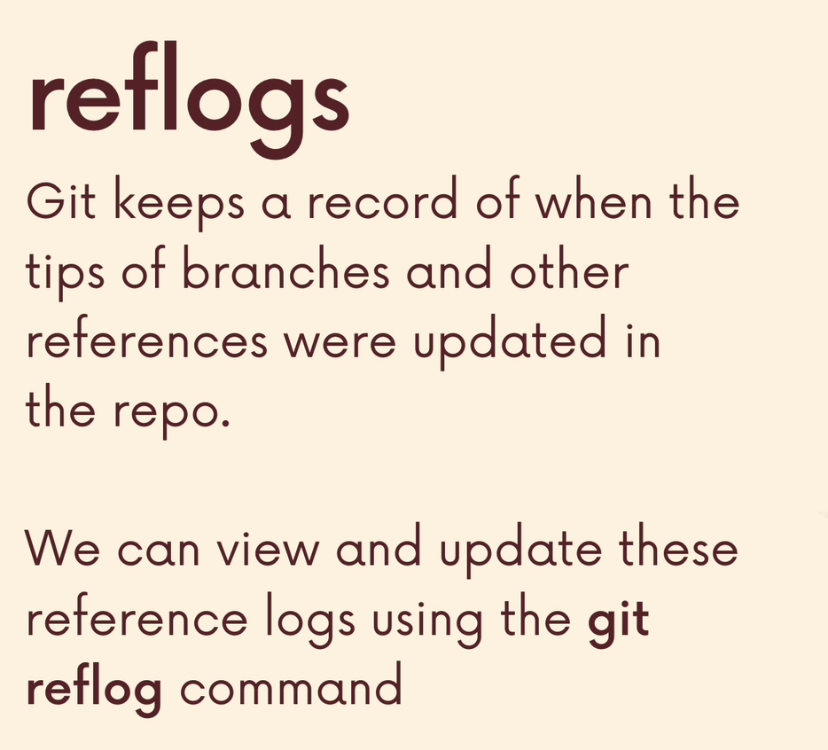
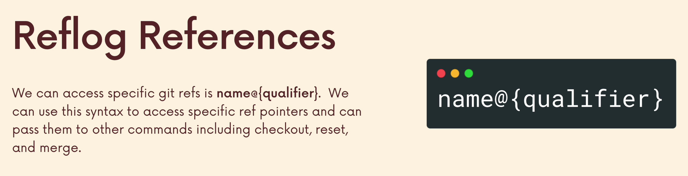
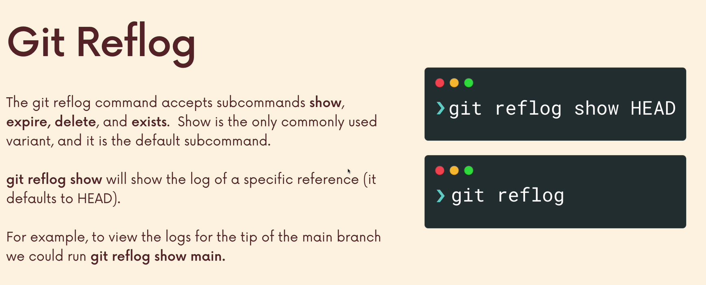
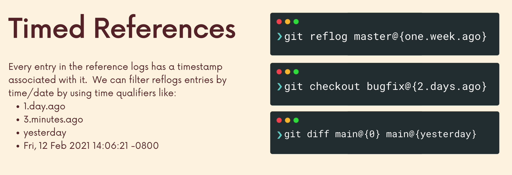

# Reflogs (Reference Logs)

**Es una refencia a un log**



El reflog es como un historial de movimientos de nuestras referencias de Git.

Git registra cuándo referencias como `HEAD` o una rama cambian de posición.


Por ejemplo:

    git reflog

Muestra algo como:

    a1b2c3d HEAD@{0}: commit: Add login

    7e8f9a0 HEAD@{1}: commit: Add navbar

    1234567 HEAD@{2}: checkout: moving from feature to main

La parte importante es que no solo se pueden los `commits`, sino también dónde estaba apuntando `HEAD` anteriormente.

## ¿Por qué es útil?

Principalmente para recuperarse de errores.

Ejemplo:

    A -- B -- C -- D

y accidentalmente hacemos un `reset` y terminamos en:

    A -- B

Parece que `C` y `D` desaparecieron.

Pero Git puede conservar esas posiciones en el reflog:

    git reflog

y podríamos encontrar:

    D HEAD@{1}: commit: ...
    C HEAD@{2}: commit: ...

Entonces podemos recuperar el estado anterior usando, por ejemplo:

    git reset --hard HEAD@{1}

o crear una rama desde ese commit:

    git branch rescue HEAD@{1}

## `git reflog show`

    git reflog show

Es el comando para mostrar el reflog de una referencia concreta.

Por defecto:

    git reflog

- Es una forma abreviada de consultar el reflog de `HEAD`

También podemos hacer:

    git reflog show main

- para consultar el reflog de la refencia `main`.

## 2. Una limitación importante


**El reflog es local**.

Si hacemos algo y Git registra ese movimiento:

    Nuestra PC
      ↓
    reflog

ese registro no se comparte automáticamente con las personas que estemos trabajando ni con GitHub.

Por eso, si alguien hace un reset en su máquina, no podemos mirar su `reflog` desde la nuestra.

Además, **los reflogs expiran de manera estándar a los 90 días.**

Git normalmente elimina entradas antiguas después de un período configurable, por lo que no se debe considerar un historial permanente.

## 3. Reflogs References



### `name@{qualifier}`es la sintaxis general.

- `name` puede ser una referencia como:

      HEAD
      main
      feature/login

- y el `qualifier` puede indicar una posición del `reflog` o un momento en el tiempo.

Por ejemplo:

    HEAD@{0}
    HEAD@{1}
    HEAD@{2}

o:

    main@{yesterday}

## 4. Índices `HEAD@{...}`



Esta sintaxis de la imagen es especialmente importante:

    git reflog

    HEAD@{0}   ← estado más reciente
    HEAD@{1}   ← estado anterior
    HEAD@{2}   ← estado anterior
    HEAD@{3}
    ...


### Ejemplo:

    a1b2c3d HEAD@{0}: commit: Add login
    7e8f9a0 HEAD@{1}: commit: Add navbar
    1234567 HEAD@{2}: checkout: moving from feature to main


Se puede pensar en ella como:

- ¿Dónde estaba `HEAD` hace N movimientos?

Por ejemplo:

    git show HEAD@{2}

Permite inspeccionar el estado al que apuntaba `HEAD` dos entradas atrás en el `reflog`.

El comando:

    git reset --hard HEAD@{1}

puede mover `HEAD` y el estado de trabajo hacia esa posición.

**Ojo**: en un ejemplo real, el número exacto (`{1}`, `{2}`, etc.) depende de lo que aparezca en cada `reflog`. No se debe asumir que siempre será `{1}`.


## 5.Referencias Temporales



`{qualifier}` no tiene por qué ser un número.

Puede ser:

    HEAD@{yesterday}

    HEAD@{2.days.ago}

    HEAD@{one.week.ago}

Comando completo:

    git show HEAD@{yesterday}

- Significa: **Muéstrame dónde estaba `HEAD` ayer.**

### IMPORTANTE

Esto **no** significa "**el commit que se hizo ayer**".

El `reflog` registra movimientos de referencias, no simplemente `commits` hechos en determinada fecha.

1. `git log` → historial de `commits` alcanzables siguiendo la historia de `commits`.

        git log

2. `git reflog` → historial de movimientos de `HEAD`/referencias en nuestro repositorio local.

        git reflog

3. **Reflog** = "botón de emergencia" de Git

Porque `git log` y `git reflog` están mirando cosas conceptualmente diferentes.

### Ejemplo:

    A -- B -- C
              ↑
            main

`git log` nos dice:

    C
    B
    A

Pero `git reflog` nos dice:

    HEAD@{0}: commit C
    HEAD@{1}: commit B
    HEAD@{2}: checkout: moving from feature to main
    ...

- El `reflog` está interesado en cómo se han movido las referencias, no en reconstruir la historia de `commits`.

## Resumen

- `git log` → muestra la historia de commits.
- `git reflog` → muestra el historial local de movimientos de referencias.
- `HEAD@{...}` → permite acceder a posiciones anteriores de `HEAD`.
- `main@{...}` → permite acceder a posiciones anteriores de `main`.
- Los reflogs son locales y pueden expirar.

### Entonces:

**`git log` = ¿qué commits forman parte de la historia?**

**`git reflog` = ¿a dónde han estado apuntando mis referencias?**

Por eso el reflog funciona como un **"botón de emergencia" de Git**.

Si accidentalmente hago un:

``` Bash
git reset --hard <hash>
git rebase --hard <hash>
git checkout --hard <hash>

```

Si parece que un `commit` desapareció, una de las primeras cosas que se debe revisar es:

    git reflog