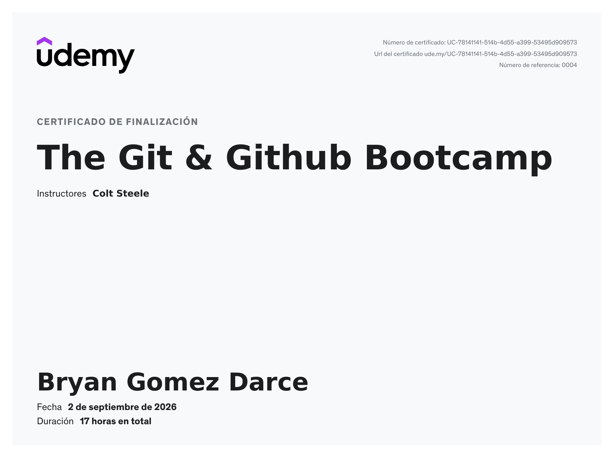

# Mis conocimientos de Git y GitHub

Este repositorio es un resumen de mi aprendizaje en Git y GitHub, desde los conceptos básicos del control de versiones y la creación de repositorios, hasta el manejo de ramas, commits, recuperación de cambios, trabajo con repositorios remotos, colaboración y funcionamiento interno de Git.

El contenido es sobre al curso de [The Git & Github Bootcamp](https://www.udemy.com/course/git-and-github-bootcamp/)

---

---

## Introducción a Git

Comprensión de Git como sistema de control de versiones distribuido y de los conceptos fundamentales necesarios para trabajar con repositorios.

* Qué es Git y para qué sirve.
* Sistemas de control de versiones.
* Git como sistema de control de versiones distribuido.
* Repositorios locales y remotos.
* Working Directory.
* Staging Area.
* Repository.
* Commits.
* Snapshots.
* Historial de cambios.
* Configuración de Git.
* `.gitconfig`.
* Configuración global, local y del sistema.

---

## Creación y configuración de repositorios

Conceptos y comandos necesarios para crear y comenzar a trabajar con un repositorio Git.

* `git init`.
* Inicialización de un repositorio.
* Directorio `.git`.
* Estructura interna básica de un repositorio.
* `git status`.
* `git add`.
* Staging Area.
* `git commit`.
* Mensajes de commit.
* Configuración de usuario.
* `user.name`.
* `user.email`.

---

## Gestión de cambios

Manejo de los diferentes estados de los archivos dentro de un repositorio y recuperación de cambios.

* Working Directory.
* Staging Area.
* Committed state.
* `git status`.
* `git add`.
* `git restore`.
* `git checkout`.
* `git reset`.
* `git revert`.
* Diferencias entre `reset` y `revert`.
* Recuperación de archivos.
* Deshacer cambios.
* Eliminar cambios del Staging Area.
* Modificar commits existentes.

### `git commit --amend`

* Modificación del último commit.
* Corrección del mensaje del commit.
* Agregar cambios al último commit.
* Situaciones en las que se debe evitar `--amend`.

---

## Ramas

Uso de ramas para desarrollar diferentes líneas de trabajo dentro de un repositorio.

* Qué es una branch.
* Creación de ramas.
* Cambio entre ramas.
* `git branch`.
* `git switch`.
* `git checkout`.
* ramas locales.
* HEAD.
* Branch actual.
* Relación entre commits y branches.
* El puntero de una rama.
* Eliminación de ramas.

### Fast-Forward

* Qué es un Fast-Forward.
* Cómo Git mueve un puntero de una rama.
* Situaciones en las que ocurre un Fast-Forward.
* Diferencia entre Fast-Forward y un merge con commit.

---

## 📌 HEAD y Detached HEAD

Comprensión del funcionamiento de `HEAD` y de qué ocurre cuando deja de apuntar a una branch.

* Qué es `HEAD`.
* HEAD apuntando a una branch.
* HEAD apuntando directamente a un commit.
* Detached HEAD.
* Cómo entrar en Detached HEAD.
* Riesgos de trabajar en Detached HEAD.
* Recuperación de commits creados en Detached HEAD.
* Uso de `git switch` para regresar a una branch.

---

## Git Stash

Almacenamiento temporal de cambios que todavía no están listos para convertirse en un commit.

* Qué es `git stash`.
* Guardar cambios temporalmente.
* `git stash`.
* `git stash pop`.
* `git stash apply`.
* `git stash list`.
* `git stash drop`.
* Stash de cambios no preparados.
* Uso de stash al cambiar de branch.
* Diferencias entre `stash pop` y `stash apply`.

---

## Historial y navegación de commits

Consulta y análisis del historial de un repositorio.

* `git log`.
* Historial de commits.
* Commit hash.
* `HEAD`.
* Referencias.
* Navegación entre commits.
* Visualización del historial.
* Relación entre commits y ramas.

---

## Git y repositorios remotos

Trabajo con repositorios remotos y sincronización entre el repositorio local y GitHub.

* Repositorios locales vs remotos.
* GitHub.
* Remote repositories.
* `origin`.
* `git remote`.
* `git push`.
* `git fetch`.
* `git pull`.
* Tracking branches.
* Upstream branches.
* Sincronización entre repositorios.
* Diferencias entre merge y rebase al hacer pull.

---

## 🔀 Git Rebase

Reorganización de commits para mantener un historial más lineal.

* Qué es `git rebase`.
* Rebase de una branch.
* Reaplicación de commits.
* Reescritura del historial.
* Rebase interactivo.
* Diferencias entre `merge` y `rebase`.
* `git pull --rebase`.
* Conflictos durante un rebase.
* Continuar un rebase.
* Cancelar un rebase.
* Cuándo utilizar rebase.
* Riesgos de reescribir historial.

---

## ↩️ Git Reset y Git Revert

Diferentes formas de deshacer cambios y modificar el historial.

### `git reset`

* Mover `HEAD`.
* `--soft`.
* `--mixed`.
* `--hard`.
* Relación entre `HEAD`, Staging Area y Working Directory.
* Eliminar commits localmente.
* Recuperar estados anteriores.

### `git revert`

* Crear un nuevo commit que deshace otro commit.
* Mantener el historial.
* Diferencia entre `reset` y `revert`.
* Cuándo utilizar cada uno.
* Uso recomendado en ramas compartidas.

---

## 🗃️ Funcionamiento interno de Git

Comprensión de cómo Git almacena y relaciona la información internamente.

### Objetos de Git

* Git Objects (Blobs, Trees, Commits).
* Object Database.
* SHA-1.
* Hashes.
* Identificación de objetos.
* Relaciones entre objetos.

---

## #️⃣ Hashing

Comprensión de las funciones hash utilizadas por Git para identificar objetos.

* Qué es una función hash.
* Propiedades de las funciones hash.
* SHA-1.

---

## 🏷️ Tags

Uso de tags para marcar puntos específicos del historial.

* Qué es un tag.
* Tags ligeros.
* Annotated tags.
* Diferencias entre lightweight tags y annotated tags.
* Información adicional almacenada en annotated tags.
* Referencias a commits.
* Uso de tags para identificar versiones.

---

## Git Aliases

Personalización de Git para simplificar comandos utilizados frecuentemente.

* Qué es un alias.
* Aliases de Git.
* Configuración mediante `.gitconfig`.
* Configuración desde la terminal.
* Uso de parámetros automáticos en aliases.

---

## `.gitignore`

Control de archivos que Git debe ignorar.

* Qué es `.gitignore`.
* Patrones de archivos.
* Ignorar archivos.
* Ignorar directorios.
* Archivos generados automáticamente.
* Archivos sensibles.
* Relación entre `.gitignore` y Git.
* Limitaciones de `.gitignore`.

---

## GitHub

Uso de GitHub como plataforma para alojar repositorios Git y colaborar con otros desarrolladores.

* Qué es GitHub.
* Git vs GitHub.
* Repositorios públicos y privados.
* GitHub repositories.
* Remote repositories.
* Cloning.
* Push y Pull.
* Branches en GitHub.
* Colaboración mediante GitHub.

---

## Forks y colaboración

Conceptos utilizados para contribuir a proyectos en los que no se tiene acceso directo al repositorio principal.

* Qué es un fork.
* Fork vs clone.
* Repositorio original.
* Repositorio fork.
* Trabajo en el fork.
* Crear branches.
* Push al fork.
* Pull Request.
* Relación entre fork y Pull Request.

### Pull Requests

* Qué es un Pull Request.
* Proponer cambios a otro repositorio.
* Revisiones de código.
* Discusión de cambios.
* Merge de un Pull Request.
* Flujo de contribución a proyectos externos.

---

## GitHub Gist

Uso de GitHub Gist para compartir fragmentos de código, comandos y apuntes.

* Qué es GitHub Gist.
* Gists públicos y secretos.
* Uso de Gist para compartir código.
* Diferencias entre Gist y repository.

---

## 🎯 Objetivo

Este repositorio funciona como material de referencia personal y como evidencia de los conocimientos y habilidades técnicas adquiridas durante el curso.
